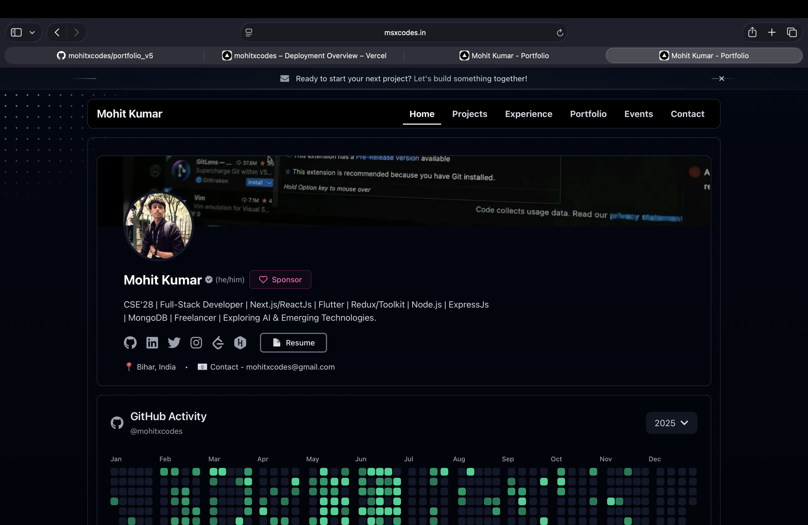
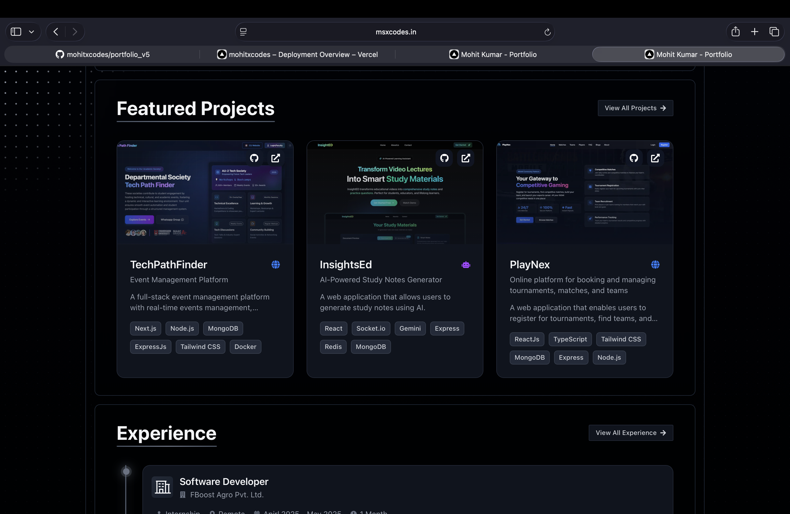
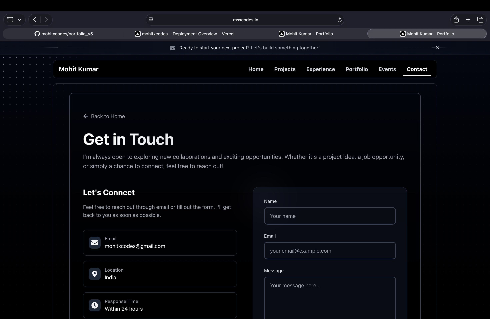

# Mohit Kumar – Portfolio v5  

A modern, elegant, and fully responsive personal portfolio built with **Next.js**, **TailwindCSS**, and **Framer Motion**.  
Live Website: https://www.msxcodes.in  
Repository: https://github.com/mohitxcodes/portfolio_v5  

---

## 📸 Preview

### Home Page  


### Projects Section  


### Contact Page  


---

## 🚀 Tech Stack

- **Frontend:** Next.js, React.js  
- **Styling:** Tailwind CSS  
- **Animations:** Framer Motion  
- **Icons:** React Icons  
- **Deployment:** Vercel  

---

## ⭐ Features

- Smooth animations and transitions  
- Fully responsive UI  
- Showcases featured projects  
- Contact form with email support  
- Clean GitHub contributions preview  

---

## 📂 Project Structure

```
portfolio_v5/
 ├── components/
 ├── app/
 ├── public/
 ├── styles/
 └── README.md
```

---

## 🧑‍💻 Author  
**Mohit Kumar**  
Full-Stack Developer | AI & Emerging Tech Enthusiast  
📧 mohitxcodes@gmail.com  

---

## 📄 License  
This project is licensed under the MIT License.
